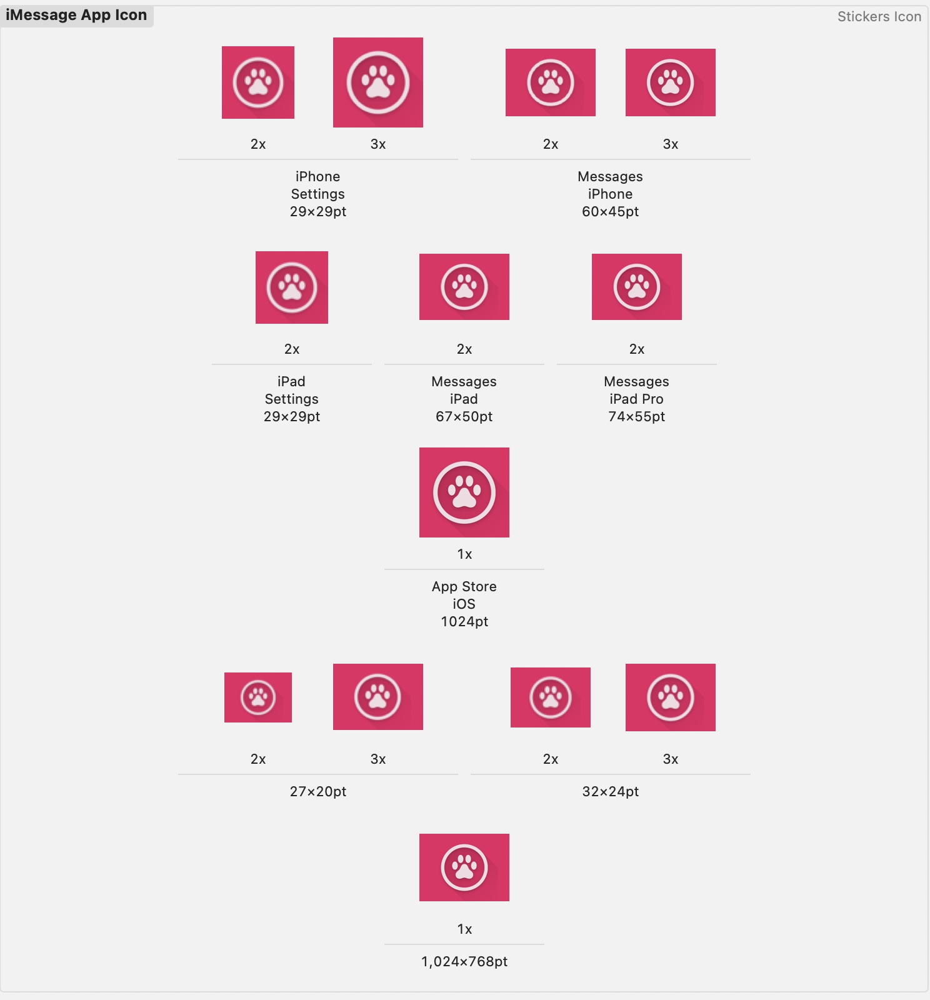

## iMessage Icon Generator

This shell script generates all the necessary iMessage app icons in different sizes and aspect ratios with a single command.
It resizes a single square logo into both square and rectangular formats while maintaining aspect ratio with an optional background color.

It also includes Contents.json, so you don’t have to manually assign images in Xcode.

### Requirements

This script requires ImageMagick to process images. You can install it via Homebrew:

```
$ sudo brew install ImageMagick
```

If Homebrew is not installed, install it first:

```
$ /bin/bash -c "$(curl -fsSL https://raw.githubusercontent.com/Homebrew/install/HEAD/install.sh)"
```

### Usage

Run the script with one square image and an optional background color in the terminal:

```
$ sh iMessage-icon-generator.sh [SRC_FILE] [BG_COLOR]
```

### Example Usage

```
$ sh iMessage-icon-generator.sh ~/project/logo.png "#FFFFFF"
```

Parameters
	•	SRC_FILE : The input square image (recommended size: 1024x1024 px).
	•	BG_COLOR (optional) : Background color for padding rectangular images. Default is white.
	•	If you want a transparent background, use "none".

### Generated Files

After running the script, it will generate all required iMessage icon sizes inside the resource folder.

| Platform         | Scale | Size (px)  | Filename                          |
|-----------------|-------|------------|-----------------------------------|
| iPhone          | @2x   | 29x29      | iphone_29x29_2x.png              |
| iPhone          | @3x   | 29x29      | iphone_29x29_3x.png              |
| iPhone          | @2x   | 60x45      | iphone_60x45_2x.png              |
| iPhone          | @3x   | 60x45      | iphone_60x45_3x.png              |
| iPad            | @2x   | 29x29      | ipad_29x29_2x.png                |
| iPad            | @2x   | 67x50      | ipad_67x50_2x.png                |
| iPad            | @2x   | 74x55      | ipad_74x55_2x.png                |
| iOS Marketing   | @1x   | 1024x1024  | ios-marketing_1024x1024_1x.png   |
| Universal       | @2x   | 27x20      | universal_27x20_2x.png           |
| Universal       | @3x   | 27x20      | universal_27x20_3x.png           |
| Universal       | @2x   | 32x24      | universal_32x24_2x.png           |
| Universal       | @3x   | 32x24      | universal_32x24_3x.png           |
| iOS Marketing   | @1x   | 1024x768   | ios-marketing_1024x768_1x.png    |

### How to Use in Xcode

After running the script, navigate to your Xcode project:

```
[YOUR XCODE PROJECT PATH]/StickerPackExtension/Stickers.xcstickers/iMessage App Icon.stickersiconset
```

Then drag all generated images and Contents.json into this folder. Xcode will automatically recognize them as app icons.

Example:

<center></center>


Why Use iMessage Icon Generator?
- 🚀 One command to generate all required iMessage icons.
- 📏 Perfectly formatted sizes for iOS, iPad, and iMessage Sticker Packs.
- 🎨 Maintains aspect ratio with optional background color.
- 💡 No more Photoshop resizing hassle!

### License

This script is open-source under the MIT License. Contributions are welcome! 🚀
